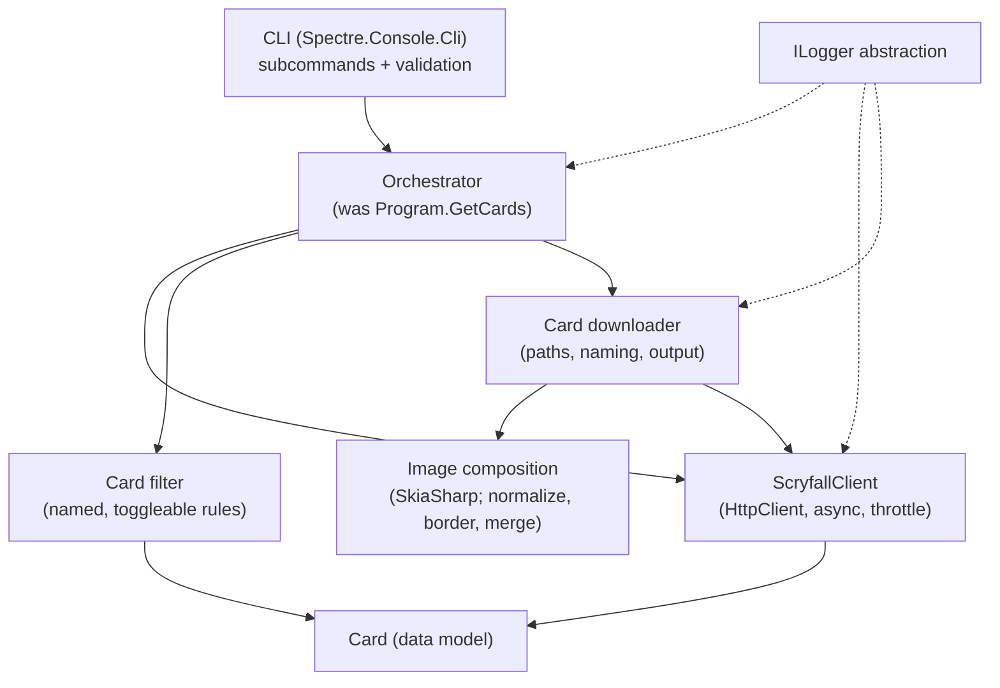

# refactor: Modernize ScatoloneDownloader

## Summary

Refactor `ScatoloneDownloader` to preserve current behavior while modernizing
the stack and making the three areas the author edits — card filtering, image
composition, and CLI input — readable and modifiable. Swap `WebRequest` for
async `HttpClient`, replace the Windows-only `System.Drawing.Common` with a
cross-platform image library behind a dedicated component, restructure the CLI
into subcommands, and route logging through a structured abstraction. `Card`
becomes a plain data model; downloading and imaging move to their own
components. Downloads stay sequential but async-ready.

## Problem Frame

The tool reads a written card list (`name -- tag`), queries the Scryfall API,
and downloads card images for physical printing. It works but is hard to evolve
exactly where the author keeps editing. The include/exclude decision is one
compound boolean in `ScatoloneDownloader/Mtg/Card.cs` (`IsValid`) crossing seven
conditions, with rule data inlined as literals. Image composition (border
normalization, outer border, the double-face front/rear merge in
`ScatoloneDownloader/Mtg/DoubleFaceCard.cs`) is graphics math with magic numbers
and commented-out dead code, built entirely on `System.Drawing.Common`, which
Microsoft has deprecated as a cross-platform surface. CLI options are split
across five interfaces with `SetName` exclusion groups, and input validation is
scattered through `Program.Run`/`GetCards` — the latter taking 11 positional
parameters. The runtime stack is legacy: `WebRequest`/`HttpWebResponse`
(obsolete in .NET 9) and synchronous `Thread.Sleep` rate limiting.

The remedy and its scope live in the origin requirements doc
(see origin: `docs/brainstorms/2026-06-19-modernize-scatolone-downloader-requirements.md`).

---

## Requirements

Carried from origin (R-IDs preserved):

**Filter & Validation** — R1 (filter as ordered named, toggleable rules), R2
(rule data in named locations), R3 (one-rule change is one-place).

**Image Composition** — R4 (imaging in a dedicated component decoupled from
`Card`), R5 (single library boundary), R6 (output equivalent in print, verified
manually), R7 (named constants, dead code removed).

**CLI Input** — R8 (consolidated options, subcommand surface acceptable), R9
(input validation collected in one place), R10 (replace the 11-parameter
`GetCards` dispatch).

**Stack Modernization** — R11 (`HttpClient`), R12 (async-capable, sequential),
R13 (cross-platform image library), R14 (structured logging abstraction), R15
(preserve the ~100ms Scryfall rate limit).

**Behavior & Safety** — R16 (`ClearFolders` optional), R17 (preserve all
existing download behavior, including the original-art un-numbered-name rule and
the Siege 180° rotation).

---

## Key Technical Decisions

- **Image library: SkiaSharp.** MIT-licensed, no build-time license-key
  friction, cross-platform via NuGet-managed native binaries; covers every
  operation needed (rotate, resize, draw, pixel sampling, fill, PNG encode).
  ImageSharp was rejected as the default despite a cleaner managed API because
  Six Labors now enforces a build-time license key
  (see Alternatives). Satisfies R5, R13.
- **CLI: Spectre.Console.Cli.** Stable (unlike `System.CommandLine`, still
  beta), first-class subcommands, and its progress/console rendering replaces
  the hand-rolled `ScatoloneDownloader/ConsoleWriter.cs`. Satisfies R8.
- **Logging: `Microsoft.Extensions.Logging` abstraction** with a console
  provider — idiomatic, swappable, replaces the `SimpleLogger` singleton.
  Satisfies R14.
- **HTTP: one `HttpClient` + async throttle gate.** A single client with an
  async "minimum next request time" gate preserves the ~100ms spacing the
  current `Thread.Sleep` enforces, without a shared concurrency throttle
  (downloads stay sequential). Satisfies R11, R12, R15.
- **`Card` becomes a data model.** Filtering, imaging, and download/path/output
  **behavior** moves out of `Card` into dedicated components; `Card` keeps its
  Scryfall-derived read-only fields (including `TypeLine`, `Colors`, `Cmc`,
  `IsBasicLand`, `Tag`, `Name`), so `CardAnalyzer` and Siege detection retain the
  data they read. This is the structural spine that makes R1–R10 land. Adjacent
  to the three named areas but required by the origin's "`Card` torna a essere
  dati" decision.

---

## High-Level Technical Design

Target component shape after the refactor — orientation for review, authoritative
detail lives in the per-unit sections:

The image library is reachable only through the Image composition component
(R5); the rest of the system never references SkiaSharp types.

---

## Implementation Units

Automated tests are deferred per origin scope; verification this round is
**manual** (R6). Each feature-bearing unit lists **Behaviors to verify** —
specific, named behaviors to check by hand now, and the exact coverage to encode
if/when a test suite is added later.

### U1. Async Scryfall HTTP client

- **Goal:** Replace `WebRequest`/`HttpWebResponse` with a single async
  `HttpClient`-based client; preserve the ~100ms request spacing.
- **Requirements:** R11, R12, R15
- **Dependencies:** none
- **Files:** `ScatoloneDownloader/GetManager.cs` (extract HTTP into a
  `ScryfallClient`), new `ScatoloneDownloader/Scryfall/ScryfallClient.cs`
- **Approach:** One reusable `HttpClient` with `Accept: */*` and the
  `ScatoloneDownloader` user-agent. An async throttle gate holds a
  "minimum next request time" and awaits the remaining delay before each call
  (replacing `Thread.Sleep`). Expose async methods for JSON fetch and image
  stream. Non-success status raises a clear exception naming the URL and status,
  mirroring today's `WebException` message.
- **Patterns to follow:** the current `GetManager.Get`/`GetJson` shape and error
  message format.
- **Behaviors to verify:** consecutive requests are spaced ≥ ~100ms; a 200
  response yields the body stream; a non-200 raises an exception naming URL and
  status; bulk-data and image URLs both fetch correctly.
- **Verification:** a real run downloads a small list end-to-end with no rate
  errors from Scryfall.

### U2. Structured logging abstraction

- **Goal:** Replace the `SimpleLogger` singleton with
  `Microsoft.Extensions.Logging` + a console provider.
- **Requirements:** R14
- **Dependencies:** none
- **Files:** `ScatoloneDownloader/SimpleLogger.cs` (remove), call sites in
  `ScatoloneDownloader/GetManager.cs`
- **Approach:** Introduce an `ILogger` obtained from a logger factory; map the
  existing `Error`/`Warning`/`Info`/`Debug`/`Trace` calls to log levels. Keep
  the existing messages (missing card, duplicate card, missing parameters).
- **Patterns to follow:** current `SimpleLogger.Instance.Warning/Error` call
  sites.
- **Test expectation:** none — mechanical substitution, no behavioral change;
  covered by the end-to-end run in U1/U6.
- **Verification:** warnings for missing/duplicate cards still appear during a
  list download.

### U3. Cross-platform image composition component

- **Goal:** Re-implement border normalization, outer-border addition, and the
  double-face front/rear merge on SkiaSharp inside a dedicated component
  decoupled from `Card`; name the magic numbers; delete dead code.
- **Requirements:** R4, R5, R6, R7
- **Dependencies:** none (takes image streams as input; U5 orchestrates the fetch)
- **Files:** new `ScatoloneDownloader/Imaging/` component, logic moved from
  `ScatoloneDownloader/Mtg/Card.cs` (`GetBorderColor`, `NormalizeBorders`,
  `AddOuterBorder`) and `ScatoloneDownloader/Mtg/DoubleFaceCard.cs`
  (`MergeFaces`, and the Siege-rotation logic from `GetImage`)
- **Approach:** The component takes image streams (plus the card's `TypeLine`,
  or a precomputed siege flag) and produces the final image. It owns the **entire**
  pipeline in this load-bearing order: **merge faces → Siege 180° rotation →
  normalize borders → outer border**. The Siege rotation currently in
  `DoubleFaceCard.GetImage` moves here. Name the constants currently inline:
  border-color sample point (20,20), border thickness (25), card dimensions
  (63×88mm), additional border (3mm), and the double-face resize ratio. Preserve
  the merge geometry (rotate faces 270°, rear on top, front on bottom at
  single-card height). Read the border-sample pixel in straight (non-premultiplied)
  ARGB so it matches `System.Drawing.GetPixel`. Remove the commented-out rectangle
  code. Only this component references SkiaSharp.
- **Patterns to follow:** the existing geometry in `Card.AddOuterBorder` and
  `DoubleFaceCard.MergeFaces` — replicate the math, not the API.
- **Behaviors to verify:** **Covers AE2.** single-face card gets normalized
  borders + 3mm outer border at correct mm proportions; double-face card merges
  rear-top/front-bottom at single-card size; a Siege card is rotated 180°;
  output is a valid PNG.
- **Verification (manual, R6):** print-compare a single-face card, a normal
  double-face card, and a Siege card before/after — indistinguishable in print.

### U4. Card filtering as named, toggleable rules

- **Goal:** Replace the compound `Card.IsValid` boolean with an ordered set of
  individually-named, individually-toggleable rules; collect inlined rule data
  into named locations.
- **Requirements:** R1, R2, R3
- **Dependencies:** none
- **Files:** new `ScatoloneDownloader/Filtering/` rules, logic moved from
  `ScatoloneDownloader/Mtg/Card.cs` (`IsValid`, `IsSetValid`, `IsLayoutValid`,
  `IsGameValid`, `IsBorderValid`, `IsDifferentFrameVariation`, and the
  `InvalidSetsType`/`InvalidFrameEffects`/`WhiteBorderSets` literals),
  `ScatoloneDownloader/GetManager.cs` (the `IsValid` call in
  `PopulateCardsByName` and the basic-land gate in `GetCardList`)
- **Approach:** Each rule is a named predicate ("valid set type", "English
  only", "not a reprint/variation", "valid layout/token", "paper game", "valid
  border", "not etched") evaluated over a card. The reprints/tokens flags toggle
  the relevant rules, matching today's `downloadReprints`/`downloadTokens`
  semantics including the basic-land exemption. Filtering is not confined to
  `IsValid`: two further sites must route through the new rules — the Files-mode
  validation inside `GetManager.PopulateCardsByName` (its `IsValid(false,false)`
  call) and the basic-land inclusion gate in `GetManager.GetCardList`
  (`BorderColor != "white"/"silver"`). After this unit no filtering remains
  scattered (R3). Rule data (invalid set types, invalid frame effects,
  white-border sets, basic-land types) lives in named, discoverable constants.
- **Patterns to follow:** the existing private predicates in `Card.cs` — they
  are already the rule seams, just inlined.
- **Behaviors to verify:** each rule includes/excludes the same cards
  `IsValid` does today; non-English excluded; reprints excluded unless the flag
  is set; basic lands still pass the reprint exemption; tokens excluded unless
  the flag is set; etched/borderless/showcase variations excluded.
- **Verification:** the validated card set for a known list matches the current
  build's output.

### U5. `Card` as data model; extract downloader/output

- **Goal:** Move download, path-building, and list-output out of `Card` into a
  downloader component so `Card` holds data only; make output paths
  cross-platform.
- **Requirements:** R4, R17
- **Dependencies:** U1, U3, U4
- **Files:** new `ScatoloneDownloader/Download/` component, logic moved from
  `ScatoloneDownloader/Mtg/Card.cs` (`Download`, `GetPath`,
  `RemoveInvalidCharacters`, `Print`, `BasePaths`),
  `ScatoloneDownloader/Mtg/SingleFaceCard.cs`,
  `ScatoloneDownloader/Mtg/DoubleFaceCard.cs`,
  `ScatoloneDownloader/GetManager.cs` (`PopulateCardsByName` un-numbered-art
  reorder)
- **Approach:** The downloader composes the Scryfall client (U1) and the imaging
  component (U3) to fetch, build, and save each card. The un-numbered-art rule
  lives in **two** places that must both be preserved: the dictionary reorder in
  `GetManager.PopulateCardsByName` (which decides which printing wins the bare
  name) and the file-numbering loop in `Card.Download`. Both currently gate on
  `IsValid(false,false)`; after U4 they obtain that "is this printing a valid
  download candidate" decision from the filter component (hence the U4
  dependency). Preserve the duplicate-name numbering. Replace the `BasePaths`
  backslash literals with cross-platform path building. `Card` and its subclasses
  keep all their Scryfall-derived fields; only behavior moves out — `CardAnalyzer`
  keeps reading `Colors`/`TypeLine`/`Cmc`/`IsBasicLand`/`Tag`/`Name`.
- **Patterns to follow:** `Card.Download` numbering loop and `GetPath` mode
  switch.
- **Behaviors to verify:** **Covers AE1.** repeated card names produce the
  original-art file un-numbered and later copies suffixed; per-mode folder
  layout (All/Set/Years/Files) unchanged; tags create subfolders; forbidden
  filename characters stripped; `Print` still appends to `List.txt`; paths build
  correctly on a non-Windows path separator.
- **Verification:** folder/file output for a known list matches the current
  build on Windows; the same run produces a sane tree on macOS/Linux.

### U6. CLI restructure with subcommands

- **Goal:** Replace the five-interface options model and the 11-parameter
  `GetCards` dispatch with Spectre.Console.Cli subcommands; collect input
  validation in one place; wire the new components.
- **Requirements:** R8, R9, R10
- **Dependencies:** U1, U2, U3, U4, U5
- **Files:** `ScatoloneDownloader/Program.cs`,
  `ScatoloneDownloader/Options/*.cs` (replace),
  `ScatoloneDownloader/ConsoleWriter.cs` (replace with Spectre progress), new
  `ScatoloneDownloader/Cli/` commands
- **Approach:** Model the modes (All, Set, Years, Files, analyze) as subcommands
  with their own typed settings; the reprints/tokens/lands/print-only flags
  attach where they apply. Collect validation — year range (1993–2050), file
  existence, mutually-exclusive modes — in one place that runs before
  orchestration. An orchestrator replaces `GetCards`, taking a settings object
  instead of 11 positional parameters. Spectre progress replaces the manual
  `ConsoleWriter` counter. Preserve the current analyze coupling: a Files-mode
  download today also writes `<file>Stats.txt` (`analyze=true`), while the
  `-d`/`FilesToAnalyze` path runs analyze with no download — keep **both**
  behaviors (Files download still emits stats; analyze-only stays available).
- **Patterns to follow:** the mode dispatch in `Program.GetCards`/`Program.Run`
  and the option semantics in `Options/CommandLineOptions.cs`.
- **Behaviors to verify:** each mode runs via its subcommand with the same
  effect as today's flags; invalid year is rejected with a clear message;
  missing input file is reported, not crashed; analyze produces the same stats
  file; print-only writes the list without downloading; progress shows
  `i / total`.
- **Verification:** every current invocation has a documented equivalent and
  produces the same output.

### U7. Optional `ClearFolders`

- **Goal:** Make folder clearing opt-in instead of deleting output folders on
  every startup.
- **Requirements:** R16
- **Dependencies:** U6
- **Files:** `ScatoloneDownloader/Program.cs` / new `ScatoloneDownloader/Cli/`
  (clear logic moved from `Program.ClearFolders`)
- **Approach:** Folder clearing runs only when explicitly requested (a
  `--clear`-style option or dedicated subcommand); a normal run leaves existing
  output intact and never blocks on a keypress.
- **Patterns to follow:** the delete logic in `Program.ClearFolders`.
- **Behaviors to verify:** **Covers AE3.** a normal run deletes nothing; the
  clear option removes All/Sets/Years/Lists; the keypress-to-delete prompt is
  gone.
- **Verification:** running without the clear option preserves a populated output
  folder.

---

## Scope Boundaries

Deferred (carried from origin, see origin doc):

- Automated test suite over filtering and image composition — verification is
  manual this round.
- Parallel downloads — would force a shared throttle and thread-safe naming.
- Externalizing filter rules to an editable config file (the origin's Approach C).

### Deferred to Follow-Up Work

- AOT/single-file packaging and trimming evaluation once SkiaSharp native assets
  are in place.

---

## Risks & Dependencies

- **Image fidelity (R6).** A different resampling engine changes pixels; the
  accepted bar is print-equivalence, checked manually on sample cards (single,
  double, Siege). Mitigation: replicate the existing geometry exactly in U3 and
  compare before merging downstream units.
- **Rate limit (R15).** Losing the ~100ms spacing risks Scryfall throttling or
  an IP ban. Mitigation: the async gate in U1 is the single choke point all
  requests pass through.
- **Behavior preservation (R17).** The duplicate-name/original-art rule and the
  per-mode folder layout are subtle. Mitigation: U4/U5 verify against the current
  build's output for a known list before proceeding.
- **Border-color pixel sampling.** The border color is a single sampled pixel
  (20,20), not resampled output — and SkiaSharp defaults to premultiplied alpha
  with a different byte order than `System.Drawing.GetPixel`, so an unhandled read
  tints every border fill (a visible, not sub-pixel, regression). Mitigation: read
  the sample in straight (non-premultiplied) ARGB and check a sample card's border
  in the manual pass.
- **SkiaSharp native assets.** Adds platform-specific binaries via NuGet;
  validate the build on at least one non-Windows target.

---

## Alternatives Considered

- **ImageSharp instead of SkiaSharp.** Cleaner fully-managed API and direct
  pixel access (attractive for the border-sampling code), and free under
  Apache-2.0 for this open-source/personal use. Rejected as default because Six
  Labors now enforces a build-time license key (sample key dated 2026-09-04),
  adding recurring build friction that undercuts the "modifiable" goal. Revisit
  if SkiaSharp's native-binary footprint becomes a problem.
- **System.CommandLine instead of Spectre.Console.Cli.** Microsoft-native, but
  still beta and parsing-only; Spectre is stable and also replaces the manual
  console progress writer.
- **Keep `Thread.Sleep` throttle, just async the I/O.** Simpler, but an async
  gate is the same complexity and keeps request spacing in one async-aware choke
  point — and R12 requires async-capable I/O regardless.

---

## Sources & Research

- Origin requirements:
  `docs/brainstorms/2026-06-19-modernize-scatolone-downloader-requirements.md`
- [Six Labors — License Changes](https://sixlabors.com/posts/license-changes/)
  and [License Enforcement Changes](https://sixlabors.com/posts/licence-enforcement-changes/)
  (ImageSharp Split License + build-time key enforcement).
- [Spectre.Console.Cli — multi-command CLI](https://spectreconsole.net/cli) and
  the comparison noting `System.CommandLine` remains beta/parsing-only.
